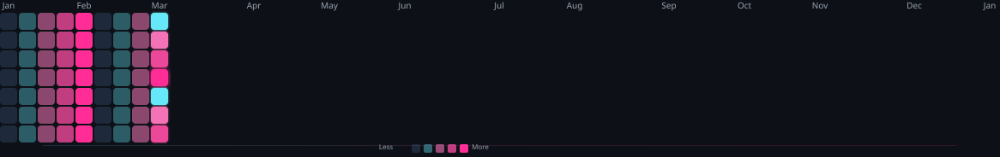

<!-- 
╔══════════════════════════════════════════════════════════════════════════════╗
║                                                                              ║
║   ███████╗ █████╗ ███╗   ██╗     █████╗ ███╗   ██╗ █████╗                 ║
║   ██╔════╝██╔══██╗████╗  ██║    ██╔══██╗████╗  ██║██╔══██╗                ║
║   ███████╗███████║██╔██╗ ██║    ███████║██╔██╗ ██║███████║                ║
║   ╚════██║██╔══██║██║╚██╗██║    ██╔══██║██║╚██╗██║██╔══██║                ║
║   ███████║██║  ██║██║ ╚████║    ██║  ██║██║ ╚████║██║  ██║                ║
║   ╚══════╝╚═╝  ╚═╝╚═╝  ╚═══╝    ╚═╝  ╚═╝╚═╝  ╚═══╝╚═╝  ╚═╝                ║
║                                                                              ║
║     📊 DATA ANALYST • ⚛️ MERN STACK DEVELOPER • 💻 SOFTWARE DEVELOPER       ║
║                                                                              ║
╚══════════════════════════════════════════════════════════════════════════════╝
-->

  
  <!-- 🎯 ANIMATED HEADER -->
  
  
   
  
  <!-- 📊 PROFILE BADGES -->
  
  &nbsp;
  
  &nbsp;
  
  &nbsp;
  
  

 

<!-- 🖥️ TERMINAL INTRO SECTION -->

  

 

 

<!-- 👤 ABOUT ME SECTION -->

  

<table>
<tr>
<td width="50%" valign="top">

### 🎯 Who I Am
name: Sanjana Bhardwaj
alias: Data & Code Enthusiast
role: Data Analyst,
MERN Stack Developer & Software Developer
location: India 🇮🇳
status: Available Immediately ⚡

core_focus:
  - 📊 Data Analysis & Visualization
  - ⚛️ Full-Stack Web Development
  - 💻 Software Engineering
  - 🗄️ Database Design & Optimization
  - 🎨 UI/UX Enthusiast

philosophy:
  "Innovating with Code & Data"
</td> <td width="50%" valign="top">
🚀 Technical Summary
yaml
I am a passionate Data Analyst & Full-Stack Developer
based in India. I specialize in turning data into
actionable insights and building robust web applications
using the MERN stack.

📊 Data Analytics: Proficient in data visualization,
statistical analysis, and deriving meaningful insights
from complex datasets.

⚛️ Full-Stack Development: Experienced in building
end-to-end web applications using MongoDB, Express.js,
React, and Node.js with clean, maintainable code.

💡 Passionate about: Leveraging AI and data-driven
solutions to solve real-world problems and create
impactful technology.
  </td> </tr> </table>

<!-- ═══════════════════════════════════════════════════════════════════════════ --><!-- 🏆 ACHIEVEMENTS SECTION --><!-- ═══════════════════════════════════════════════════════════════════════════ -->

 <!-- GitHub Trophies --> 

<!-- ═══════════════════════════════════════════════════════════════════════════ --><!-- 📊 GITHUB ANALYTICS --><!-- ═══════════════════════════════════════════════════════════════════════════ -->

 <!-- GitHub Stats + Streak in ONE ROW -->  &nbsp;&nbsp; 

<!-- 📊 REAL-TIME LANGUAGE USAGE WITH PROGRESS BARS --> 

<!-- Activity Graph --> 

<!-- Additional Stats Cards --> 

<!-- ═══════════════════════════════════════════════════════════════════════════ --><!-- 🎮 CONTRIBUTION SHOWCASE --><!-- ═══════════════════════════════════════════════════════════════════════════ -->

 <!-- Snake Contribution Graph --> <picture> <source media="(prefers-color-scheme: dark)" srcset="./assets/snake-contribution-graph-dark.svg"/> <source media="(prefers-color-scheme: light)" srcset="./assets/snake-contribution-graph-dark.svg"/>  </picture>  
🐍 Watch the snake eat my contributions! Dynamically updated.

<!-- ═══════════════════════════════════════════════════════════════════════════ --><!-- ⚡ TECH STACK --><!-- ═══════════════════════════════════════════════════════════════════════════ -->

<!-- 📊 DATA ANALYTICS --><h4>📊 Data Analytics & Visualization</h4> 
  &nbsp;  &nbsp;  &nbsp;  &nbsp;  &nbsp;  
<!-- 💻 WEB DEVELOPMENT --><h4>💻 MERN Stack & Web Development</h4> 
  &nbsp;  &nbsp;  &nbsp;  
<!-- 🛠️ TOOLS & TECHNOLOGIES --><h4>🛠️ Tools & Technologies</h4> 
  &nbsp;  &nbsp;  &nbsp;  &nbsp;  

<!-- ═══════════════════════════════════════════════════════════════════════════ --><!-- 🔥 CURRENTLY WORKING ON --><!-- ═══════════════════════════════════════════════════════════════════════════ -->

⚡ Currently Building & Learning

 &nbsp;  &nbsp; 

<!-- ═══════════════════════════════════════════════════════════════════════════ --><!-- 🌐 CONNECT WITH ME --><!-- ═══════════════════════════════════════════════════════════════════════════ -->

 &nbsp;  &nbsp;  &nbsp; 

<!-- ═══════════════════════════════════════════════════════════════════════════ --><!-- 💡 RANDOM DEV QUOTE --><!-- ═══════════════════════════════════════════════════════════════════════════ -->

💭 Random Dev Quote
  

<!-- ═══════════════════════════════════════════════════════════════════════════ --><!-- 🌟 FOOTER --><!-- ═══════════════════════════════════════════════════════════════════════════ -->
 

<!-- ═══════════════════════════════════════════════════════════════════════════ --><!-- 📝 END OF README --><!-- ═══════════════════════════════════════════════════════════════════════════ -->
